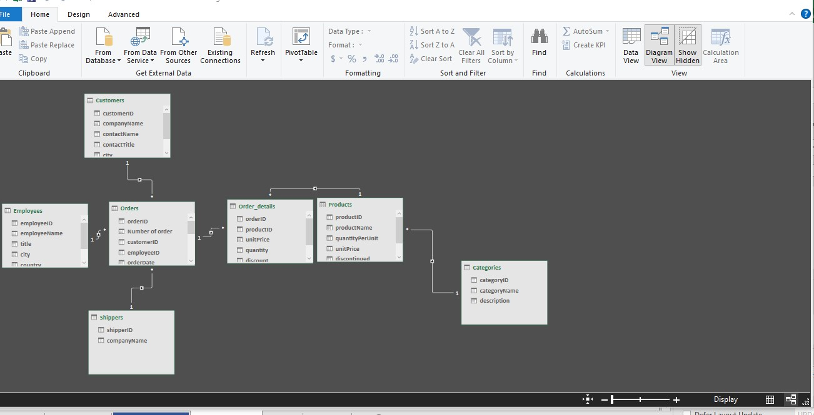
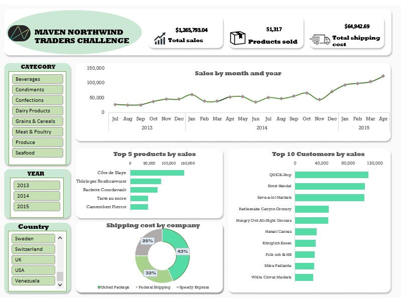
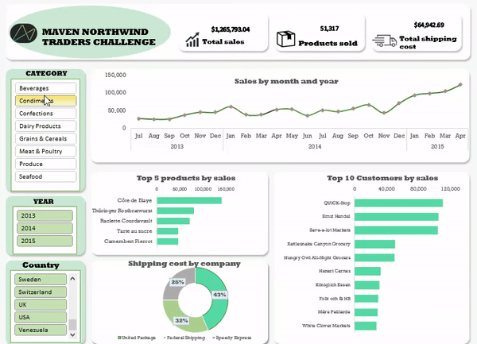
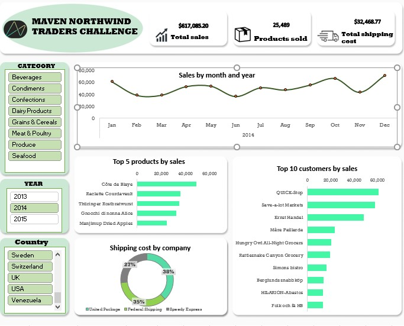
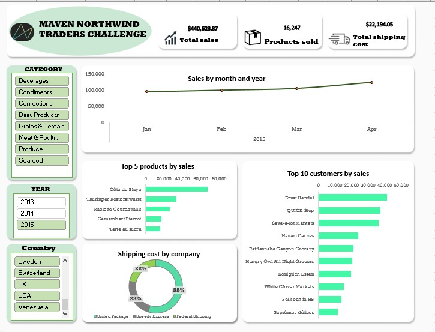
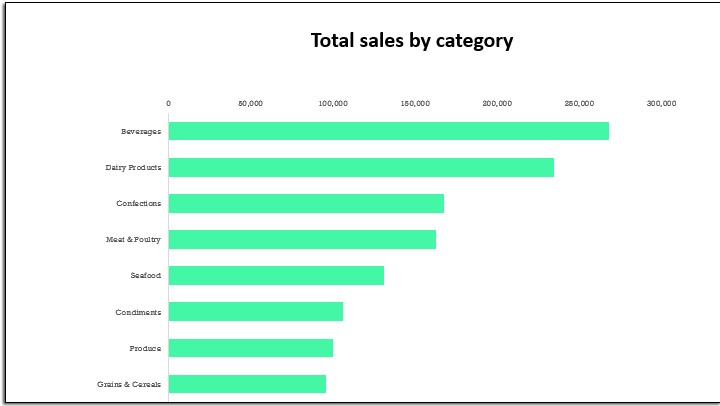

# Excel-Dashboard
# Northwind traders Analysis (Maven Analytics Challenge)

## Introduction 
Northwind Traders is a global import and export company that specializes in supplying high-quality gourmet food products to restaurants, cafes, and specialty food retailers around the world. This project was aimed at creating a top-level KPI dashboard for the executive team to help them make insightful decisions and increase the sales of the company. This project analysis and its visualization were done in Microsoft Excel📊.

## Problem Statement
The project was aimed at highlighting key areas of the Northwind traders business, this areas includes:
1.	_Sales trends_: An analysis of this would help the company to evaluate how the business is doing and help improve it sales.
2.	_Product performance_: This area will help the company to know which products to better focus on to improve the sales and performace of the company.
3.	_Key customers_: Knowing the key customers will enable the executive team work out a reward system that will encourage customers to shop more with the company.
4.	_Shipping costs_: An analysis of this will help to see how the shipping cost affects sales and what changes can be made in terms of the best shippers to use to improve sales.

## Data Sourcing
This data was gotten from the Maven Analytics playground as part of the Maven Northwind traders challenge. Here is a [link to the dataset](https://maven-datasets.s3.amazonaws.com/Northwind+Traders/Northwind+Traders.zip) for your reference.

**_Disclaimer_**: The data in this dataset is fictitious and was made for the purpose of learning and practice.

## Skills / Concept demonstrated
The following Microsoft excel features were used in this analysis:
-	Power pivot
- Pivot tables
-	Calculated field
-	Chart creation and modification.
- Filters
- Slicers

## Data Modeling
The dataset provided one main table called the _orders_ and six(6) other tables with supporting information, so using the power pivot feature I created a Data model in the query editor. Below is a picture of the relationship created:

## Visualization
The visualization is a one page interactive report, the background of the dashboard was created on figma and imported to Microsoft excel. Below is a screenshot of the dashboard 

The dashboard also contains customized slicers on the left hand side that filters down the data to reveal specific insights by categories, years or country, or all three.

## Insights and Recommendation
-	Analysis of the data shows a $176,462 decline in total sales between the year 2014 and 2015, there was also a 9,242 drop in the number of product sold in the year 2015 as compared to 2014. There was also a $2.62 increase in the average shipping cost in 2015 compared to that of 2014 and these may have resulted in the decrease in sales in that year, although a further analysis of previous years and how change in shipping cost have affected sales will be necessary to confirm this observation.
 
   2014 Sales Report                    |            2015 Sales Report
  :----------------------------------------:|:-----------------------------------------------------:|
                          | 

- The analysis also reveals that the category **_beverages_** was the highest selling with a sales of $267,868 and closely following this is the **_dairy_** category with a sales of $234,507. Looking at this I would recommend that more attention be given to this categories as they are more appealing to the market.

  

- _Quick-stop_ was found to be the top performing customer on an average for the 3 year period covered by this analysis.

  ----------------------------------------- 

  
          _source: Howie on unsplash_
